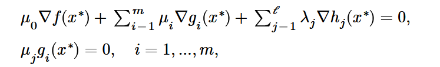
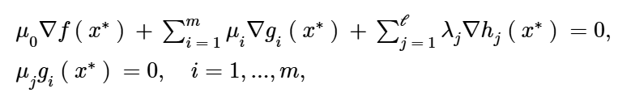
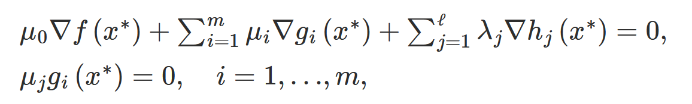

# Naive Implementation of Typst Math-to-MathML Converter

The only provided function is `convert_to_mathml`:

```Rust
    let input = r#"
$
&mu_0 gradient f(x^*) + sum_(i = 1)^m mu_i gradient g_i (x^*) + sum_(j = 1) ^ cal(l) lambda_j gradient h_j (x^*) = 0, \

&mu_j g_i (x^*) = 0, quad i = 1, dots, m,
$
"#;

    println!("{}", convert_to_mathml(input, false));
```

The output is 

```
<math display="block"><semantics><mtable><mtr><mtd style="text-align: right"></mtd><mtd style="text-align: left"><msub><mi>μ</mi><mn>0</mn></msub><mo form="prefix">∇</mo><mrow><mi>f</mi><mrow><mrow><mo fence="true" form="prefix">(</mo><msup><mi>x</mi><mo form="infix">∗</mo></msup><mo fence="true" form="postfix">)</mo></mrow></mrow></mrow><mo>+</mo><munderover><mo largeop="true">∑</mo><mrow><mi>i</mi><mo>=</mo><mn>1</mn></mrow><mi>m</mi></munderover><msub><mi>μ</mi><mi>i</mi></msub><mo form="prefix">∇</mo><msub><mi>g</mi><mi>i</mi></msub><mrow><mrow><mo fence="true" form="prefix">(</mo><msup><mi>x</mi><mo form="infix">∗</mo></msup><mo fence="true" form="postfix">)</mo></mrow></mrow><mo>+</mo><munderover><mo largeop="true">∑</mo><mrow><mi>j</mi><mo>=</mo><mn>1</mn></mrow><mi>𝓁</mi></munderover><msub><mi>λ</mi><mi>j</mi></msub><mo form="prefix">∇</mo><msub><mi>h</mi><mi>j</mi></msub><mrow><mrow><mo fence="true" form="prefix">(</mo><msup><mi>x</mi><mo form="infix">∗</mo></msup><mo fence="true" form="postfix">)</mo></mrow></mrow><mo>=</mo><mn>0</mn><mo separator="true">,</mo></mtd></mtr><mtr><mtd style="text-align: right"></mtd><mtd style="text-align: left"><msub><mi>μ</mi><mi>j</mi></msub><msub><mi>g</mi><mi>i</mi></msub><mrow><mrow><mo fence="true" form="prefix">(</mo><msup><mi>x</mi><mo form="infix">∗</mo></msup><mo fence="true" form="postfix">)</mo></mrow></mrow><mo>=</mo><mn>0</mn><mo separator="true">,</mo><mspace width="1.0em"></mspace><mi>i</mi><mo>=</mo><mn>1</mn><mo separator="true">,</mo><mi mathvariant="normal">…</mi><mo separator="true">,</mo><mi>m</mi><mo separator="true">,</mo></mtd></mtr></mtable></semantics></math>
```

Different platforms render the result quite differently, even when using the same font.

Firefox (NewCMMath Font):


Chrome (NewCMMath Font):


MathJax (Default Font):
